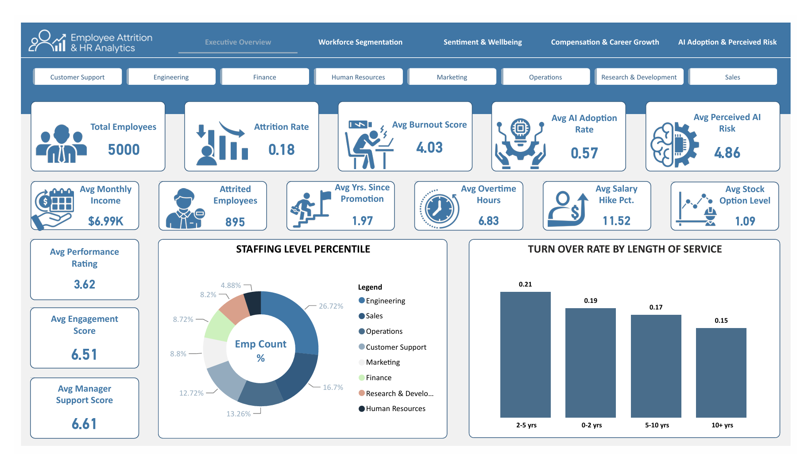
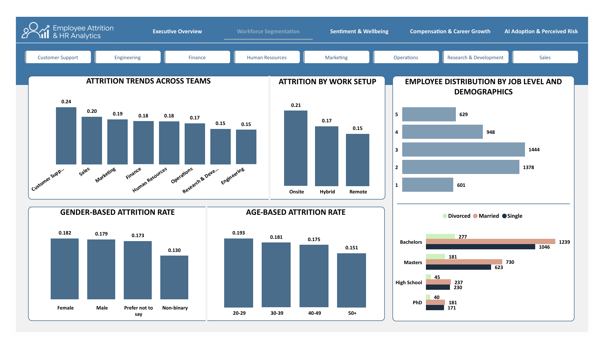
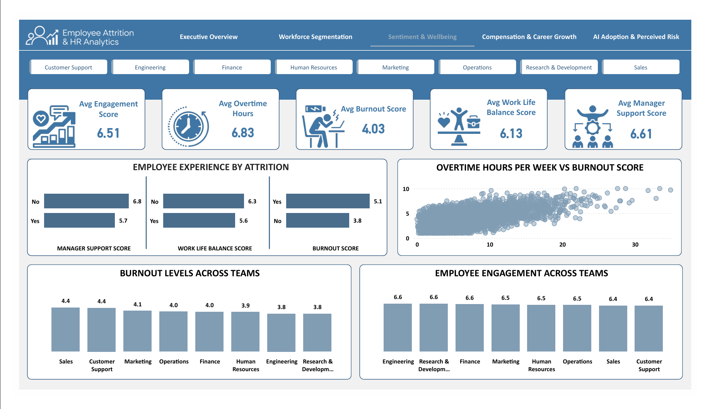
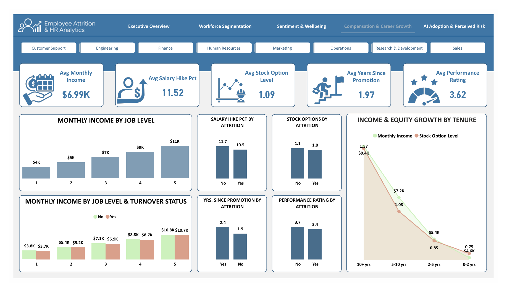
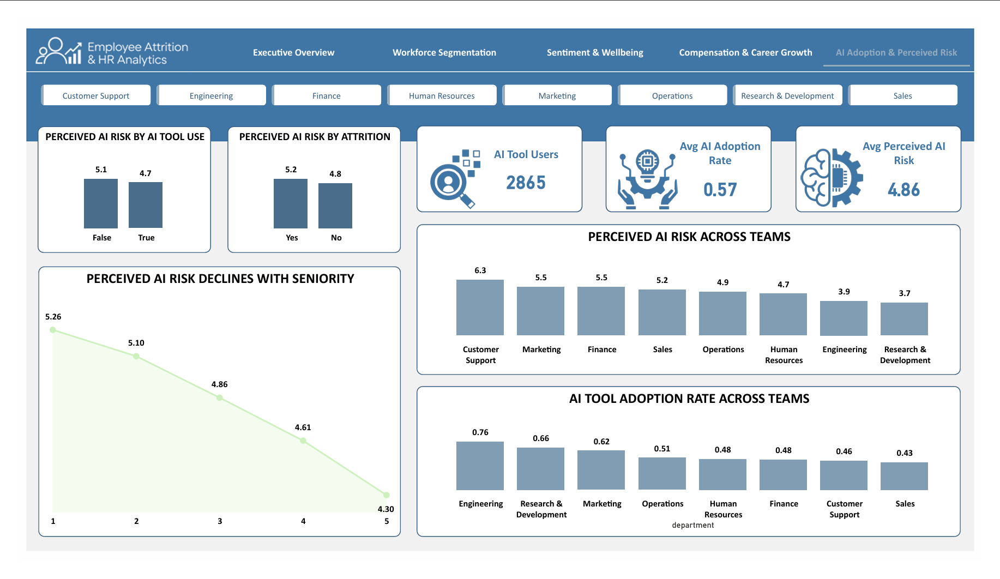

<div align=center>
  
# Employee Attrition & HR Analytics Dashboard

A PBI dashboard analyzing employee attrition, burnout, and workplace perceptions of AI, built using Power BI Desktop and Google BigQuery.

</div>

---

## Overview

This project turns a 5,000 record HR dataset into a five page dashboard covering workforce composition, employee sentiment, compensation, and how employees perceive AI's impact on their jobs. Data is stored and modeled in BigQuery, then visualized in Power BI Desktop using DAX driven measures.

The dashboard is organized into five pages:

1. **Executive Overview**: headline KPIs and workforce composition
2. **Workforce Segmentation**: attrition broken down by department, work mode, age, and gender
3. **Sentiment & Wellbeing**: burnout, engagement, work life balance, and manager support
4. **Compensation & Career Growth**: pay, equity, and promotion patterns across tenure and attrition
5. **AI Adoption & Perceived Risk**: how employees perceive AI's threat to their roles

---

## Objective & Key Insights

The goal of this dashboard is to identify the strongest drivers of employee attrition and present them clearly enough for a non-technical stakeholder to act on them.

- Overall attrition sits at 18%, and it is highest among employees in their second to fifth year at the company (21%), higher than both newer hires (19%) and long tenured staff (15%).
- Customer Support has the highest attrition rate of any department at 24%, while Engineering and Research & Development are the lowest at 15%.
- Onsite employees leave at a higher rate (21%) than hybrid (17%) or remote (15%) employees.
- Overtime hours track closely with burnout, employees who log more overtime consistently report higher burnout scores.
- Employees who left the company report lower manager support (5.7 vs 6.8), weaker work life balance (5.6 vs 6.3), and higher burnout (5.1 vs 3.8) than employees who stayed.
- Monthly income and stock option levels rise steadily with tenure, from $4.6K and 0.75 average options for employees with 0 to 2 years at the company, up to $9.4K and 1.57 average options for employees with 10 or more years.
- Employees who left had smaller salary increases (10.5% vs 11.7%), lower performance ratings (3.4 vs 3.7), and had gone longer without a promotion (2.4 years vs 1.9 years) than employees who stayed.
- Perceived AI job risk declines consistently with seniority, from 5.26 at job level 1 down to 4.30 at job level 5.
- Employees who actively use AI tools at work report feeling less threatened by it (4.7) than employees who do not use them (5.1).
- Customer Support reports the highest perceived AI risk of any department (6.3), while Research & Development reports the lowest (3.7), despite R&D having one of the highest AI tool adoption rates (0.66).

---

## Measures & Metrics

The dashboard is powered by 16 DAX measures, grouped by the page they support.

| Page | Measures |
|---|---|
| Executive Overview | `Total Employees`, `Attrited Employees`, `Attrition Rate`, `Avg Burnout Score`, `Avg Engagement Score`, `Avg Perceived AI Risk` |
| Workforce Segmentation | Reuses Executive Overview measures, sliced by segment |
| Sentiment & Wellbeing | `Avg Work Life Balance Score`, `Avg Manager Support Score`, `Avg Overtime Hours` |
| Compensation & Career Growth | `Avg Monthly Income`, `Avg Salary Hike Pct`, `Avg Stock Option Level`, `Avg Years Since Promotion`, `Avg Performance Rating` |
| AI Adoption & Perceived Risk | `AI Tool Users`, `AI Tool Adoption Rate` |

---

## Data Dictionary

**Source:** [Employee Attrition & HR Analytics 2026](https://www.kaggle.com/datasets/uditjain13/employee-attrition-and-hr-analytics-2026) by uditjain13 on Kaggle.

The table below documents every column used in the dashboard.

| Column | Definition |
|---|---|
| `employee_id` | Unique identifier for each employee record |
| `department` | The department the employee belongs to (e.g. Engineering, Sales, Customer Support) |
| `job_level` | Seniority level within the organization, from 1 (entry level) to 5 (senior or executive) |
| `work_mode` | The employee's current work arrangement: Hybrid, Onsite, or Remote |
| `gender` | Employee's self reported gender |
| `marital_status` | Employee's marital status (Married, Single, or Divorced) |
| `education_level` | Highest level of education attained (High School, Bachelor's, Master's, or PhD) |
| `age_group` | Employee's age, grouped into bands: 20 to 29, 30 to 39, 40 to 49, and 50 plus |
| `tenure_band` | Length of time at the company, grouped into bands: 0 to 2, 2 to 5, 5 to 10, and 10 plus years |
| `burnout_score` | Self reported burnout level on a scale of 1 to 10 |
| `engagement_score` | Employee engagement rating on a scale of 1 to 10 |
| `work_life_balance_score` | Work life balance rating on a scale of 1 to 10 |
| `manager_support_score` | Employee's rating of support received from their manager, on a scale of 1 to 10 |
| `overtime_hours_per_week` | Average number of overtime hours worked per week |
| `monthly_income` | Employee's monthly salary |
| `stock_option_level` | Level of stock options granted, from 0 to 3 |
| `salary_hike_pct` | Percentage increase from the employee's most recent salary review |
| `years_since_promotion` | Number of years since the employee's last promotion |
| `performance_rating` | Formal performance rating, on a scale of 2 to 5 |
| `uses_ai_tools_at_work` | Whether the employee regularly uses AI tools as part of their job |
| `perceived_ai_job_risk` | Employee's self rated perception of how likely AI is to impact or replace their role, on a scale of 1 to 10 |
| `attrition` | Whether the employee has left the company. This is the primary outcome variable used throughout the dashboard |

---

## Technology Used

| Technology | Role |
|---|---|
| **Google BigQuery** | Data warehouse, stores the raw table and the curated reporting view |
| **SQL** | Builds the curated view that Power BI connects to |
| **Power BI Desktop** | Report authoring, data modeling, and visualization |
| **DAX** | Powers all measures used across the dashboard |

---

## Dashboard Preview

<div align="center">
  <br>
  <strong>Figure 1: Executive Overview</strong><br>
  <strong>Key Findings:</strong> 5,000 employees tracked overall, with an 18% attrition rate and Engineering making up the largest share of the workforce at 26.7%
</div>
<br>
<div align="center">
  <br>
  <strong>Figure 2: Workforce Segmentation</strong><br>
  <strong>Key Findings:</strong> Customer Support has the highest attrition rate at 24%, and onsite employees leave more often than hybrid or remote employees
</div>
<br>
<div align="center">
  <br>
  <strong>Figure 3: Sentiment & Wellbeing</strong><br>
  <strong>Key Findings:</strong> Overtime hours track closely with burnout, and employees who left report lower manager support and work life balance than those who stayed
</div>
<br>
<div align="center">
  <br>
  <strong>Figure 4: Compensation & Career Growth</strong><br>
  <strong>Key Findings:</strong> Income and stock options grow steadily with tenure, while employees who left had smaller raises and longer gaps since their last promotion
</div>
<br>
<div align="center">
  <br>
  <strong>Figure 5: AI Adoption & Perceived Risk</strong><br>
  <strong>Key Findings:</strong> Perceived AI risk declines with seniority, and employees who use AI tools at work report feeling less threatened by it than those who do not
</div>

---

## Project Structure

```
/ 
├── employee-attrition-and-hr-analytics-2026.pbix
├── create_vw_dashboard_employees.sql
├── dataset/
│   └── employee_attrition_hr_2026.csv
├── preview/
│   └── executive_overview.png
│   └── workforce-segmentation.png
│   └── sentiment_wellbeing.png
│   └── compensation_career_growth.png
│   └── ai_adoption_perceived_risk.png
├── README.md
└── LICENSE
```

---

## Setup & Reproduction

1. Create a BigQuery project, load the source CSV into a `raw_employees` table, then run `create_vw_dashboard_employees.sql` to create the curated view.
2. Open `employee-attrition-and-hr-analytics-2026.pbix` in Power BI Desktop and reconnect the BigQuery data source under Transform Data, Data source settings, using your own project ID.

---

## Acknowledgments

- Dataset: [uditjain13](https://www.kaggle.com/uditjain13) on Kaggle, *Employee Attrition & HR Analytics 2026*
